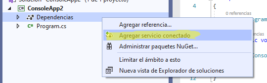

# SQL Server Reporting Services en .Net Core

Created: 21/5/2020
Description: Las librerías de integración de SSRS no funcionan en .net core sin embargo SSRS cuenta con un servicio web con el cual podremos usarlo en nuestros proyectos de .net core
Tags: NetCore, Reporting Services, SQL

Net Core no cuenta con ninguna con soporte oficial para SQL Server Reporting Services (SSRS), sin embargo se puede utilizar un web service el cual permite generar y exportar sus reportes.

La URL a consumir cuenta con un formato similar al siguiente, donde <ServerName> es la instancia de tu servidor de SSRS

    https://<Server Name>/ReportServer/ReportExecution2005.asmx?wsdl

Visual studio permite importar y generar código en base a un webservice existente, se puede realizar con los siguientes pasos:

1.  Click derecho en la sección "Dependencias" y seleccionar la opción "Agregar servicio conecado"

    

2. Seleccionar la opción "Microsoft WCF Web Service Reference Provider"

    

3. Llenar el wizard que aparecera en pantalla con la url del webservice y el namespace en el cual se desea generar el codigo

    

El siguiente fragmento de código es un pequeño ejemplo para poder comenzar a utilizar el webservice desde una aplicación de net core

```csharp
private ReportExecutionServiceSoapClient GetProxy()
{
    var proxy = new ReportExecutionServiceSoapClient(GetBinding(), GetEndpointAddress());
    proxy.ClientCredentials.Windows.ClientCredential = new NetworkCredential(config.ReportUserName, config.ReportPassword, config.ReportUserNameDominio);

    return proxy;
}

private HttpBindingBase GetBinding(bool isHttps)
{
    HttpBindingBase result = null;

    if (isHttps)
    {
        result = new BasicHttpsBinding() 
        { 
            Security = { 
                Mode = BasicHttpsSecurityMode.Transport 
            }
        };
    }
    else
    {
        result = new BasicHttpBinding() 
        {
            Security = { 
                Mode = BasicHttpSecurityMode.TransportCredentialOnly,
                Transport = { 
									ClientCredentialType = HttpClientCredentialType.Ntlm, 
                  ProxyCredentialType = HttpProxyCredentialType.None
                }
            }
        };
    }

    result.MaxReceivedMessageSize = int.MaxValue;
    result.MaxBufferSize = int.MaxValue;

    return result;
}

public async Task<object> ExportReport(string reportPath, string reportName, Dictionary<string, string> parameters)
{
    try
    {
        var proxy = GetProxy();
        var rsParameters = parameters.Select(it => new ParameterValue() { Name = it.Key, Value = it.Value }).ToArray();
        var trustedUserHeader = new TrustedUserHeader();
        
        var loadResponse = await proxy.LoadReportAsync(trustedUserHeader, $"{reportPath}{reportName}", null);
        var executionHeader = new ExecutionHeader()
        { 
            ExecutionID = loadResponse.executionInfo.ExecutionID
        };

        await proxy.SetExecutionParametersAsync(executionHeader, trustedUserHeader, rsParameters, "");

        var request = new RenderRequest(executionHeader,
            trustedUserHeader,
            exportType.ToString(),
            new XElement("DeviceInfo", new XElement("OutputFormat", "PDF")).ToString()
        );

        var response = await proxy.RenderAsync(request);

        await proxy.CloseAsync();

        return new 
        {
            Bytes = response.Result,
            Encoding = response.Encoding,
            FileNameExtension = response.Extension,
            MimeType = response.MimeType,
            Streams = response.StreamIds,
            Warnings = response.Warnings?.Select(it => it.Message).ToArray()
        };
    }
    catch (Exception ex)
    {
        string message = ex.GetBaseException().Message;
        throw ex;
    }
}
```

Ahora con la función "**ExportReport**" se podra exportar cualquier reporte de SSRS como PDF, por ejemplo

```csharp
var report = await ExportReport("intancia/misReportes", 
	"Empleados",
	new Dictionary<string, string>() { {"Departamento", "IT"} }
);
```

Para mas información respecto a este tema, se pueden consultar los siguientes enlaces:

[Report Server Web Service Endpoints - SQL Server Reporting Services (SSRS)](https://docs.microsoft.com/en-us/sql/reporting-services/report-server-web-service/methods/report-server-web-service-endpoints?view=sql-server-ver15)